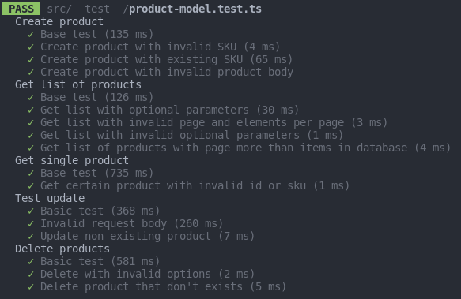

<h1 align="center"><a href="https://github.com/xsolla/xsolla-school-backend-2021">Xsolla School 2021 Backend Test</a></h1>

<div align="center">

[]()
[](/LICENSE)


</div>

---

## Содержание

- [Описание](#about)
- [Реализовано](#working)
- [Требования](#requirments)
- [Установка](#installation)
- [Использование](#usage)
- [Настройка](#configuration)
- [Тестирование](#tests)
- [Зависимости](#dependencies)
- [Контакты](#contacts)

## 🧐 Описание <a name = "about"></a>

Тестовое задание для Xsolla School 2021 Backend


## Реализованные задания <a name = "working"></a>

<ul>
    <li> <h4>Получение каталога товаров</h4>
        <ul>
            <li>Список товаров возвращается страницами</li>
            <li>Доступны фильтры
                <ul>
                    <li>Тип товара - указывается список типов в результирующей выборке</li>
                    <li>Стоимость товара - необходимо указать минимальную и максимальную стоимость товара.</li>
                </ul>
            </li>
        </ul>
    </li>
    <li> <h4>Получение информации о товаре по его идентификатору или SKU</h4></li>
    <li> <h4>Создание товара</h4>
        <ul>
            <li>Уникальный идентификатор - следующее число последовательности (sequense) в базе данных</li>
        </ul>
    </li>
    <li> <h4>Редактирование всех данных товара  по его идентификатору или SKU</h4></li>
    <li> <h4>Удаление товара по его идентификатору или SKU</h4></li>
    <li> <h4>Документация OpenAPI 3.0 в <a href="docs/api.json">docs/api.json</a></h4></li>
    <li> <h4>README.md</h4></li>
    <li> <h4>Тесты</h4></li>
</ul>


## Требования <a name = "requirments"></a>

- Node js v.14.17.3 и выше
- npm v.6.5 и выше
- PostgreSQL v.12 и выше

## Установка  <a name = "installation"></a>

В качестве хранилища данных используется СУБД PostgreSQL. Перед запуском приложения необходимо
- Создать пользователя и базу данных, [например](src/db/create-user-and-db.sql)
- Создать таблицу в базе данных <i>products</i>, [например](src/db/create-user-and-db.sql)
- <b>Опционально</b> Можно заполнить базу тестовыми данными с помощью [скрипта](src/db/insert-data.sql)

Перед запуском необходимо скачать зависимости для проекта. Чтобы это сделать выполните команду 

```npm i```

Проверить успешно ли прошла установка можно с помощью [тестов](#tests)

## Использование <a name = "usage"></a>

Для запуска воспользуйтесь командой 

```npm run start```

## Настройка <a name = "configuration"></a>

Для настройки некоторых параметров используется файл .env
- <b>PGUSER</b> - имя пользователя СУБД
- <b>PGPASSWORD</b> - пароль пользователя
- <b>PGDATABASE</b> - название используемой базы данных
- <b>PGHOST</b> - адрес postgreSQL
- <b>PGPORT</b> - порт работы postgresSQL
- <b>SERVER_HOST</b> - адрес работы приложения
- <b>SERVER_PORT</b> - порт работы приложения

## Тестирование <a name = "tests"></a>

Команда запуска тестов

```npm run test```



## Зависимости <a name = "dependencies"></a>

- [Express](https://github.com/expressjs/express)
- [Node Postgres](https://github.com/brianc/node-postgres)
- [SQL Template Strings](https://github.com/felixfbecker/node-sql-template-strings)
- [Dotenv](https://github.com/motdotla/dotenv)
- [Typescript](https://github.com/Microsoft/TypeScript)
- [Jest](https://github.com/facebook/jest)
- [Lodash](https://github.com/lodash/lodash)

## Контакты <a name = "contacts"></a>

- Почта: siarhei.me@gmail.com 
- Telegram: <a href = "t.me/c3zp0">@c3zp0</a>
